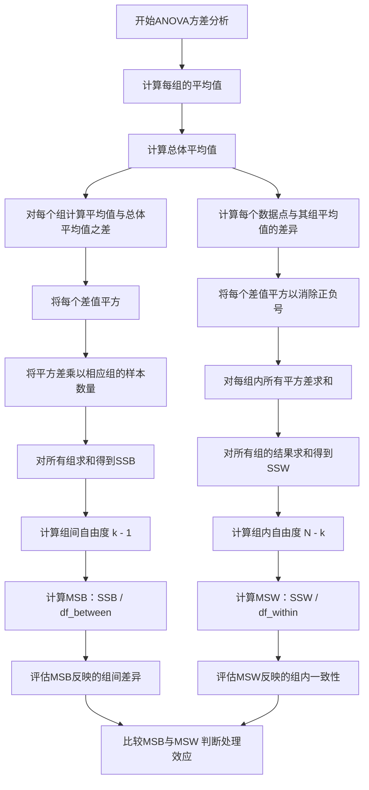

我明白了，方差分析之所以要求群体之间方差齐性是因为方差分析所使用的统计量决定的，

假设样本abc的方差为

1、10、100000000，那么

最终指示f分布的统计量F灵敏度大大降低




## 原始数据

```python
组A（低剂量）: [8, 9, 7, 10, 9]
组B（中剂量）: [12, 11, 13, 14, 12]
组C（高剂量）: [15, 14, 16, 17, 15]

```

当然，让我们一步步完整地重新展现这个ANOVA计算的正确过程，包括原始数据、计算组间（MSB）和组内（MSW）方差，以及最终的F值。

### 原始数据

- **组A（低剂量）**: [8, 9, 7, 10, 9]
- **组B（中剂量）**: [12, 11, 13, 14, 12]
- **组C（高剂量）**: [15, 14, 16, 17, 15]

### 第一步：计算每组的平均值和总体平均值

- 组A的平均值: 8.6
- 组B的平均值: 12.4
- 组C的平均值: 15.4
- 总体平均值: 12.133

### 第二步：计算组间方差（MSB）

1. **组间方差的分子（SSB）计算**:

\[ SSB = (5 \times (8.6 - 12.133)^2) + (5 \times (12.4 - 12.133)^2) + (5 \times (15.4 - 12.133)^2) = 116.32 \]

2. **计算MSB**:

\[ MSB = \frac{SSB}{df_{between}} = \frac{116.32}{2} = 58.16 \]

### 第三步：计算组内方差（MSW）

1. **组内方差的分子（SSW）计算**:

\[ SSW = \sum (x_{Ai} - \bar{x}_A)^2 + \sum (x_{Bi} - \bar{x}_B)^2 + \sum (x_{Ci} - \bar{x}_C)^2 = 109.33 \]

2. **计算MSW**:

\[ MSW = \frac{SSW}{df_{within}} = \frac{109.33}{12} = 9.11 \]

### 第四步：计算F值

\[ F = \frac{MSB}{MSW} = \frac{58.16}{9.11} = 6.38 \]

### 完整的计算过程

通过这个过程，我们计算得到的**F值**是6.38，这个值用于评估三个剂量水平对效果的影响是否有统计学上的显著差异。一个高的F值通常指示至少有一个组的平均值与其他组存在显著差异。

希望这次的解释和计算过程更加清晰和准确。
