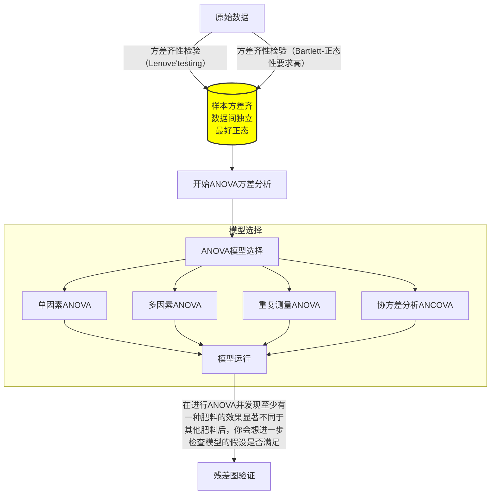
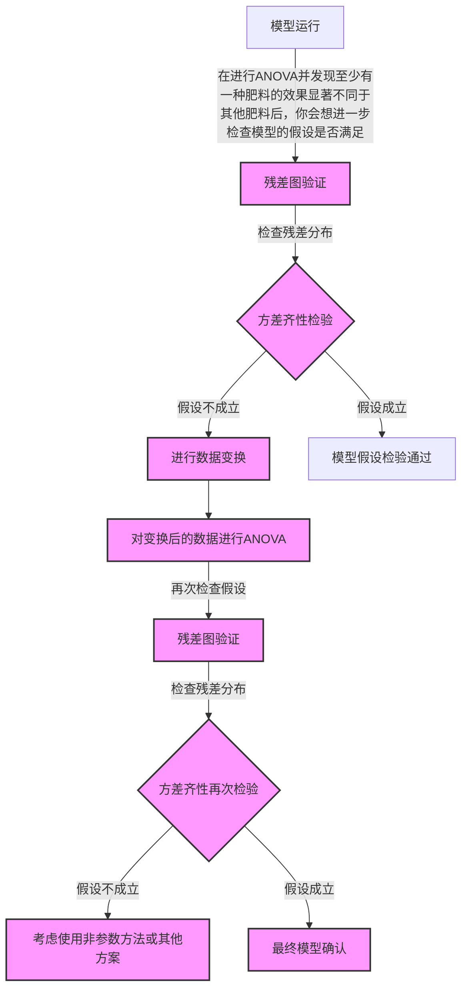
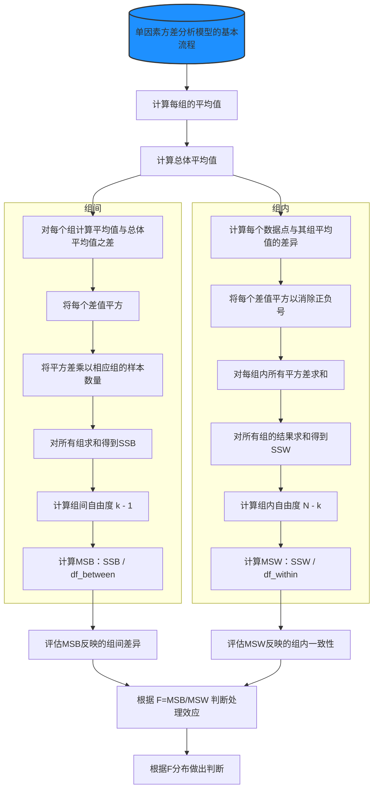
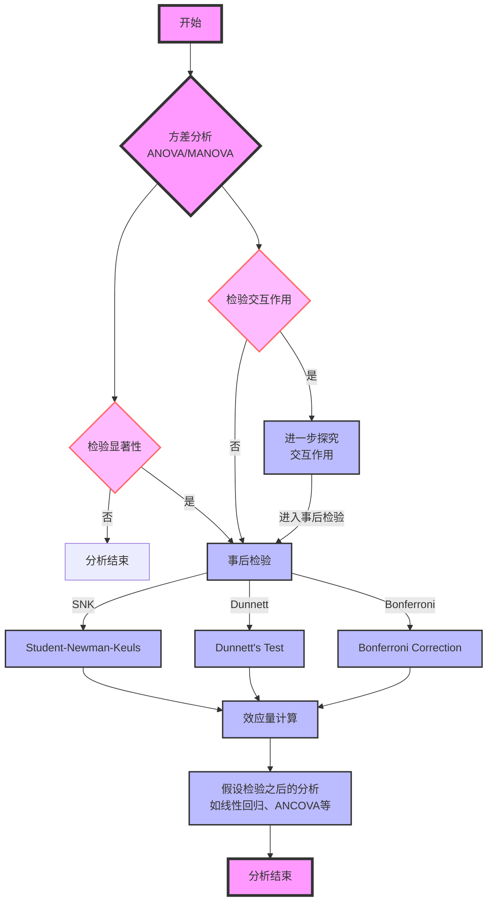
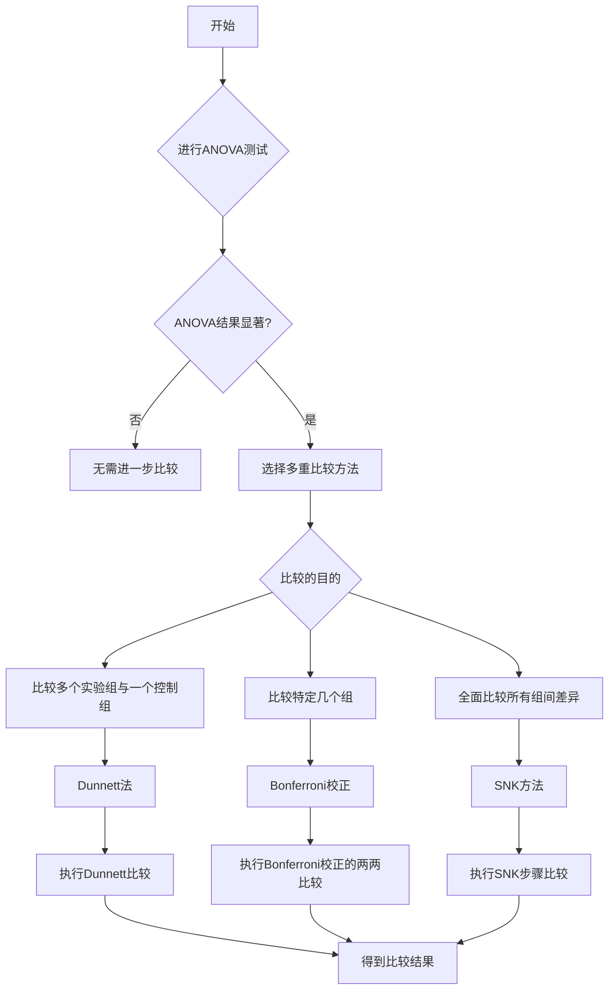

```mermaid
 graph TD

```

方差分析处理的是连续变量，而卡方处理的是分类变量

方差分析之所以要求群体之间方差齐性是因为方差分析所使用的统计量决定的，

若样本a、b、c的方差分别为：1、10、100000000，那么

最终指示F分布的统计量F灵敏度将大大降低









# 单因素方差分析

### 原始数据

```python
组A（低剂量）: [8, 9, 7, 10, 9]
组B（中剂量）: [12, 11, 13, 14, 12]
组C（高剂量）: [15, 14, 16, 17, 15]

```

当然，让我们一步步完整地重新展现这个ANOVA计算的正确过程，包括原始数据、计算组间（MSB）和组内（MSW）方差，以及最终的F值。

### 第一步：计算每组的平均值和总体平均值

- 组A的平均值: 8.6
- 组B的平均值: 12.4
- 组C的平均值: 15.4
- 总体平均值: 12.133

### 第二步：计算组间方差（MSB）

组间方差（Mean Square Between, MSB）在ANOVA（方差分析）中用来衡量各组平均值之间的差异程度，从而反映了不同组（或处理条件）之间的变异性。下面是计算组间方差的步骤：

#### 第一步：计算每组的平均值和总体平均值
- 对于每个组，计算其所有数据点的平均值。
- 计算所有数据点的总体平均值，即所有组数据点的平均值。

#### 第二步：计算组间方差的分子（SSB，Sum of Squares Between）
- 对每个组而言，计算该组平均值与总体平均值之间的差异。
- 将这个差异平方，以确保差异的方向（正负）不影响最终结果。
- 将每个平方差乘以相应组的样本数量（这是因为更大的样本数量增加了该组平均值对总体平均值差异的“权重”）。
- 将上述所有组的结果加总，得到组间平方和（SSB）。

#### 第三步：计算组间自由度（df_between）
- 组间自由度是组数减1（$k - 1$），其中$k$是组的数量。

#### 第四步：计算组间方差（MSB）
- 将组间平方和（SSB）除以组间自由度（df_between），得到组间方差（MSB）。

$$
MSB = \frac{SSB}{df_{between}} 
$$


这个结果MSB代表了平均每个自由度上的方差量，反映了不同组之间平均值的变异性。

#### 示例
假设我们有两组数据：

- **组A**: [8, 9, 7, 10, 9]（平均值 = 8.6）
- **组B**: [12, 11, 13, 14, 12]（平均值 = 12.4）

且假设总体平均值为10.5（这个值是所有数据点的平均值）。

计算步骤如下：

1. **计算每组的平均值**：8.6（组A），12.4（组B）。
2. **计算总体平均值**：10.5。
3. **计算SSB**：基于每组平均值与总体平均值之间的差异。
4. **计算df_between**：$k - 1$，如果有两组，则为1。
5. **计算MSB**：$MSB = \frac{SSB}{df_{between}}$。

通过这个过程，我们可以量化不同组之间的平均值的差异，进而评估不同处理或条件的效果是否存在统计学上的显著差异。

### 第三步：计算组内方差（MSW）

组内方差（Mean Square Within, MSW）在ANOVA（方差分析）中代表了组内数据点相对于各自组平均值的波动或差异程度。计算MSW的目的是评估各组内部的一致性或变异性。具体计算流程如下：

#### 第一步：计算组内差异
对于每个组，计算组内每个数据点与该组平均值之间的差异。然后，将这个差异平方，目的是消除差异的方向（正负），只关注差异的大小。

#### 第二步：求和得到组内平方和（SSW）
将第一步中得到的所有平方差加总，得到组内平方和（Sum of Squares Within, SSW）。这一步是将所有组的组内平方差加总，得到一个反映所有组内波动性的总量。

#### 第三步：计算组内方差的自由度
组内方差的自由度（df_within）是总样本数$N$减去组数$k$。自由度反映了在计算方差时可自由变动的数据点数量。

#### 第四步：计算组内方差（MSW）
将组内平方和（SSW）除以其对应的自由度（df_within），得到组内方差（MSW）。

$$
 MSW = \frac{SSW}{df_{within}} = \frac{SSW}{N - k} 
$$

这个结果MSW代表了平均每个自由度上的方差量，即组内平均的变异性。

#### 示例
假设我们有两组数据：

- **组A**: [8, 9, 7, 10, 9]
- **组B**: [12, 11, 13, 14, 12]

计算步骤如下：

1. **计算每组的平均值**：组A的平均值，组B的平均值。
2. **计算每个数据点与其组平均值的差的平方**，然后对每个组进行求和。
3. **求和得到SSW**：将所有组的结果相加。
4. **计算自由度**：$df_{within} = N - k$，其中$N$是总样本数量，$k$是组的数量。
5. **计算MSW**：$MSW = \frac{SSW}{df_{within}}$。

通过这个过程，我们能够得到一个反映所有组内数据点波动性或一致性的度量。

### 第四步：计算F值

$$
F = \frac{MSB}{MSW} = \frac{58.16}{9.11} = 6.38
$$


让我们通过这个例子来了解组间和组内差异


在这个有趣例子中，组间差异和组内差异都是零


这个例子中，组间差距依旧为零，而组内差距较大（球不一样）


因变量（Dependent Variable, DV）

自变量（Independent Variable, IV）

因变量（Dependent Variable, DV）是在实验或观察研究中你试图测试或测量的变量。它是对研究中的自变量（Independent Variable, IV）响应或变化的结果。简而言之，因变量是“依赖”的变量，其值取决于一个或多个其他变量（即自变量）的变化。

#### `什么是结果显著？`

若统计量落在统计量对应的分布的小区间里？小概率事件于是结果显著

 

这个问题触及了统计术语的历史和传统。在统计学中，“显著”（significant）一词用来描述一个结果是在统计学意义上不太可能是偶然发生的。这个术语起源于20世纪初，当时的统计学家，包括罗纳德·费舍尔（Ronald Fisher），开始发展假设检验理论。费舍尔是在1925年首次引入“显著性”这个概念，特别是在他的著作《统计学方法和科学推理》中。

#### 为什么叫它“显著”？

- **历史传统**：在早期统计学的文献中，当观察到的数据在统计上强烈指示某个事件不太可能仅由随机变异导致时，这种情况被称为“显著的”（significant）。这意味着数据显示出了一种模式或效应，这种模式或效应在统计上是“显著的”，即它超出了随机波动所能解释的范围。

- **强调发现**：“显著性”一词的使用强调了发现的非随机性或意义。当一个结果被称为“统计学上显著”的时候，这意味着结果不太可能仅仅由偶然因素造成，因此，这个词强调了结果背后可能存在的实际影响或效应。

#### 为什么不叫它“不显著”？

- **逻辑和语境**：“不显著”（not significant）这个术语实际上也被广泛使用，但它用于指代那些统计检验未能拒绝零假设的情况，即观测结果可能与随机变异相符合，没有足够的证据表明存在显著的效应或差异。在这种情况下，使用“不显著”是为了表明数据没有显示出足以超越随机波动的模式或效应。

#### 结论

因此，“显著”和“不显著”这两个术语在统计学中共同存在，分别用来描述结果是否足够强烈以至于不太可能仅仅由随机因素导致。这些术语的选择反映了统计学的传统，以及对于结果意义的解释：一个“显著”的发现指向了超越随机性的模式或效应，而“不显著”的结果则没有足够的证据支持这样的结论。








# q检验（ Student Newman Keuls）

Q检验（也称为SNK法，即Student-Newman-Keuls方法）是一种后续多重比较测试，用于在方差分析（ANOVA）发现显著差异后，识别哪些具体的组间平均值存在显著差异。这种方法旨在平衡统计检验的灵敏度和整体错误率（特别是第一类错误，即假阳性率）之间的关系。以下是Q检验的基本思路和步骤：

### 步骤1：进行ANOVA
- 首先，进行一方ANOVA来确定是否至少有一个组的平均值与其他组不同。如果ANOVA的结果不显著，那么没有必要进一步进行多重比较。
- 如果ANOVA显示至少有一个组不同，那么可以使用Q检验来确定哪些组之间存在显著差异。

### 步骤2：排列均值
- 将所有组的平均值按升序或降序排列。

### 步骤3：计算Q统计量
- 对于任意两个组的平均值，计算它们之间的Q统计量。Q统计量的计算公式为：

  $
  Q = \frac{\left| \bar{X}_1 - \bar{X}_2 \right|}{\text{SE}}
  $

  其中，$\bar{X}_1$和$\bar{X}_2$是两个比较组的平均值，SE是标准误差，通常基于组内方差和各组样本量来计算。

### 步骤4：比较Q统计量与临界值（没有Q分布，只有Q表）
- 使用特定的α水平（如0.05）和相关的自由度，查找或计算Q检验的临界值。这个临界值通常通过查阅SNK的临界值表来获取。
- 如果计算出的Q统计量大于临界值，那么我们可以拒绝零假设，认为两组平均值之间存在显著差异。

### 步骤5：进行所有必要的比较
- 对所有可能的组合进行比较。这包括不仅是相邻的组，也包括不相邻的组。理论上，每一对组合都应该进行比较，但实际上，人们通常首先关注相邻组的比较，因为这些比较更可能显示出显著差异。

### 步骤6：控制错误率
- 通过上述步骤，Q检验考虑到了多重比较问题，并试图控制整体第一类错误率。尽管如此，进行大量比较时仍需谨慎，因为这可能增加发现至少一个假阳性差异的机会。

### 小结
Q检验的优点是它可以同时考虑多个比较，而不是单独考虑每个比较，从而减少了整体的第一类错误率。然而，由于它是一种后续测试，必须首先执行ANOVA并发现显著差异。此外，Q检验比一些其他多重比较方法（如Tukey的HSD测试）更不保守，可能在某些情况下导致更高的第一类错误率。因此，选择哪种后续测试方法取决于研究的具体需求、对错误的容忍程度以及样本大小等因素。

# Bonferroni校正

`非常保守，甚至过保守，有效控制I类错误（假阳性）`


进行Bonferroni校正后的两两比较主要涉及计算每一对组合的统计显著性，并将得到的p值与校正后的显著性水平进行比较。以下是具体步骤：

### 步骤1: 确定校正后的显著性水平
首先，确定校正后的显著性水平。如果原始的显著性水平是α，并且你打算进行n次比较，那么校正后的显著性水平为：

$$
\text{校正后的}\ \alpha = \frac{\alpha}{n}
$$

### 步骤2: 进行比较
对于每一对你想要比较的组合：

- 计算这两组数据的统计显著性，通常通过进行独立样本t检验或其他适当的比较方法，取决于数据的性质和分布。
- 得到每次比较的p值。

### 步骤3: 比较p值和校正后的显著性水平
对于每次比较：

- 如果p值小于或等于校正后的显著性水平，则认为这两组之间有统计学上的显著差异。
- 如果p值大于校正后的显著性水平，则认为这两组之间没有统计学上的显著差异。

### 例子
假设你有4组数据（A、B、C、D），你的原始显著性水平是0.05，并计划进行6次比较。因此，校正后的显著性水平为0.05/6 ≈ 0.0083。

假设你已经进行了以下两两比较，并得到了相应的p值：

- A vs. B: p = 0.02
- A vs. C: p = 0.005
- A vs. D: p = 0.01
- B vs. C: p = 0.03
- B vs. D: p = 0.07
- C vs. D: p = 0.001

将每个p值与校正后的显著性水平0.0083进行比较：

- A vs. B的p值（0.02）> 0.0083，因此A和B之间没有显著差异。
- A vs. C的p值（0.005）< 0.0083，因此A和C之间有显著差异。
- A vs. D的p值（0.01）> 0.0083，因此A和D之间没有显著差异。
- B vs. C的p值（0.03）> 0.0083，因此B和C之间没有显著差异。
- B vs. D的p值（0.07）> 0.0083，因此B和D之间没有显著差异。
- C vs. D的p值（0.001）< 0.0083，因此C和D之间有显著差异。

### 结论
通过这个过程，你可以准确地识别出哪些组之间存在统计学上的显著差异。Bonferroni校正提供了一种简单有效的方式来控制多重比较的整体第一类错误率，尽管它可能比较保守。

# Dunnett法

让我们通过一个具体的例子来解释Dunnett法的应用。

### 研究背景
假设你是一位农业科学家，正在研究三种新的杀虫剂（分别称为A、B、C）对作物产量的影响，并将它们与未处理的控制组（D）进行比较。目标是找出哪些杀虫剂能显著提高产量。

### 实验设计
- **控制组（D）**：未使用杀虫剂的作物。
- **实验组**：
  - **A组**：使用杀虫剂A的作物。
  - **B组**：使用杀虫剂B的作物。
  - **C组**：使用杀虫剂C的作物。
- 每个组包含30株作物，实验持续一个生长季。

### 步骤1: 进行ANOVA
实验结束后，你测量了每株作物的产量，并进行了方差分析（ANOVA），结果表明至少有一个处理组的平均产量与控制组存在显著差异。

### 步骤2: 使用Dunnett法进行比较
现在，你需要使用Dunnett法来确定是哪些具体的杀虫剂处理组（A、B、C）与控制组（D）之间的产量差异达到了统计学上的显著性。

### 计算和比较
- 你计算了每个实验组与控制组之间的平均产量差异。
- 然后，使用Dunnett法计算的临界值来判断这些差异是否统计显著。这里，我们假设已经通过查表得到了适当的临界值。

### 假设结果如下
- **A组与D组**的平均产量差异的p值为0.02。
- **B组与D组**的平均产量差异的p值为0.15。
- **C组与D组**的平均产量差异的p值为0.005。
- 假设根据样本大小和比较次数，通过Dunnett校正后的显著性水平为0.017。

### 结果解读
- **A组与D组**：p值0.02 < 0.017，因此A处理显著增加了产量。
- **B组与D组**：p值0.15 > 0.017，因此B处理没有显著增加产量。
- **C组与D组**：p值0.005 < 0.017，因此C处理显著增加了产量。

### 结论
根据Dunnett法的结果，你得出结论，与未处理的控制组相比，杀虫剂A和C能显著提高作物的产量，而杀虫剂B的效果并不显著。

通过这个例子，我们可以看到Dunnett法如何帮助科学家在控制整体第一类错误率的同时，准确地识别出哪些处理与控制组存在显著差异。

# 残差图

检查模型假设


这里展示的是另一些残差图，同样地，您可以看到异方差性和方差齐性之间的区别：

- **异方差性图（Heteroscedasticity - Example 2）**：残差的分散度随自变量的增大而增大，表明残差的方差也随之增大。
- **方差齐性图（Homoscedasticity - Example 2）**：残差的分布相对均匀，与自变量的变化无明显相关性，显示出残差的方差保持相对恒定。

通过不同的数据生成和回归分析，这些图像进一步说明了在回归分析中判断残差的异方差性与方差齐性的重要性。

