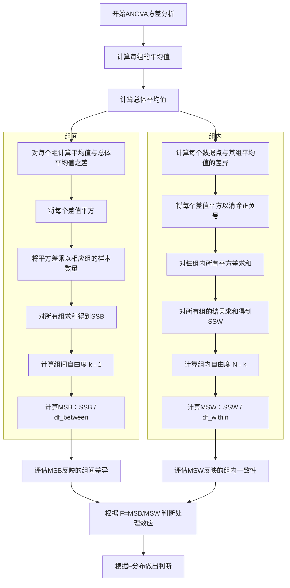

我明白了，方差分析之所以要求群体之间方差齐性是因为方差分析所使用的统计量决定的，

假设样本abc的方差为

1、10、100000000，那么

最终指示f分布的统计量F灵敏度大大降低




## 原始数据

```python
组A（低剂量）: [8, 9, 7, 10, 9]
组B（中剂量）: [12, 11, 13, 14, 12]
组C（高剂量）: [15, 14, 16, 17, 15]

```

当然，让我们一步步完整地重新展现这个ANOVA计算的正确过程，包括原始数据、计算组间（MSB）和组内（MSW）方差，以及最终的F值。

### 第一步：计算每组的平均值和总体平均值

- 组A的平均值: 8.6
- 组B的平均值: 12.4
- 组C的平均值: 15.4
- 总体平均值: 12.133

### 第二步：计算组间方差（MSB）

组间方差（Mean Square Between, MSB）在ANOVA（方差分析）中用来衡量各组平均值之间的差异程度，从而反映了不同组（或处理条件）之间的变异性。下面是计算组间方差的步骤：

#### 第一步：计算每组的平均值和总体平均值
- 对于每个组，计算其所有数据点的平均值。
- 计算所有数据点的总体平均值，即所有组数据点的平均值。

#### 第二步：计算组间方差的分子（SSB，Sum of Squares Between）
- 对每个组而言，计算该组平均值与总体平均值之间的差异。
- 将这个差异平方，以确保差异的方向（正负）不影响最终结果。
- 将每个平方差乘以相应组的样本数量（这是因为更大的样本数量增加了该组平均值对总体平均值差异的“权重”）。
- 将上述所有组的结果加总，得到组间平方和（SSB）。

#### 第三步：计算组间自由度（df_between）
- 组间自由度是组数减1（$k - 1$），其中$k$是组的数量。

#### 第四步：计算组间方差（MSB）
- 将组间平方和（SSB）除以组间自由度（df_between），得到组间方差（MSB）。

$ MSB = \frac{SSB}{df_{between}} $

这个结果MSB代表了平均每个自由度上的方差量，反映了不同组之间平均值的变异性。

#### 示例
假设我们有两组数据：

- **组A**: [8, 9, 7, 10, 9]（平均值 = 8.6）
- **组B**: [12, 11, 13, 14, 12]（平均值 = 12.4）

且假设总体平均值为10.5（这个值是所有数据点的平均值）。

计算步骤如下：

1. **计算每组的平均值**：8.6（组A），12.4（组B）。
2. **计算总体平均值**：10.5。
3. **计算SSB**：基于每组平均值与总体平均值之间的差异。
4. **计算df_between**：$k - 1$，如果有两组，则为1。
5. **计算MSB**：$MSB = \frac{SSB}{df_{between}}$。

通过这个过程，我们可以量化不同组之间的平均值的差异，进而评估不同处理或条件的效果是否存在统计学上的显著差异。

### 第三步：计算组内方差（MSW）

组内方差（Mean Square Within, MSW）在ANOVA（方差分析）中代表了组内数据点相对于各自组平均值的波动或差异程度。计算MSW的目的是评估各组内部的一致性或变异性。具体计算流程如下：

#### 第一步：计算组内差异
对于每个组，计算组内每个数据点与该组平均值之间的差异。然后，将这个差异平方，目的是消除差异的方向（正负），只关注差异的大小。

#### 第二步：求和得到组内平方和（SSW）
将第一步中得到的所有平方差加总，得到组内平方和（Sum of Squares Within, SSW）。这一步是将所有组的组内平方差加总，得到一个反映所有组内波动性的总量。

#### 第三步：计算组内方差的自由度
组内方差的自由度（df_within）是总样本数$N$减去组数$k$。自由度反映了在计算方差时可自由变动的数据点数量。

#### 第四步：计算组内方差（MSW）
将组内平方和（SSW）除以其对应的自由度（df_within），得到组内方差（MSW）。

$ MSW = \frac{SSW}{df_{within}} = \frac{SSW}{N - k} $

这个结果MSW代表了平均每个自由度上的方差量，即组内平均的变异性。

#### 示例
假设我们有两组数据：

- **组A**: [8, 9, 7, 10, 9]
- **组B**: [12, 11, 13, 14, 12]

计算步骤如下：

1. **计算每组的平均值**：组A的平均值，组B的平均值。
2. **计算每个数据点与其组平均值的差的平方**，然后对每个组进行求和。
3. **求和得到SSW**：将所有组的结果相加。
4. **计算自由度**：$df_{within} = N - k$，其中$N$是总样本数量，$k$是组的数量。
5. **计算MSW**：$MSW = \frac{SSW}{df_{within}}$。

通过这个过程，我们能够得到一个反映所有组内数据点波动性或一致性的度量。

### 第四步：计算F值

$$
F = \frac{MSB}{MSW} = \frac{58.16}{9.11} = 6.38 
$$


让我们通过这个例子来了解组间和组内差异


在这个有趣例子中，组间差异和组内差异都是零


这个例子中，组间差距依旧为零，而组内差距较大（球不一样）
