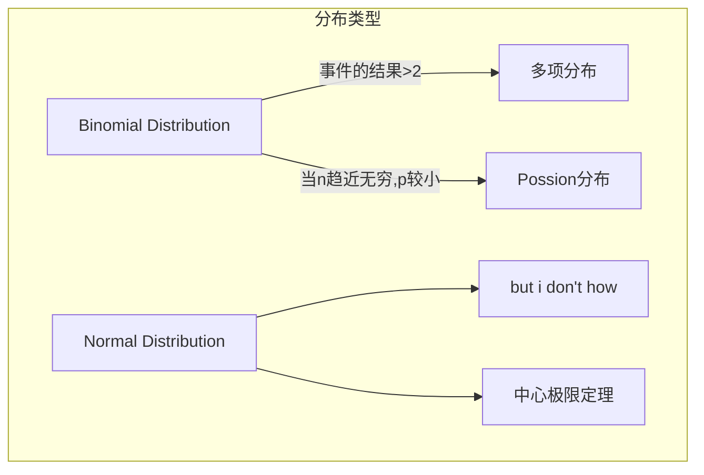
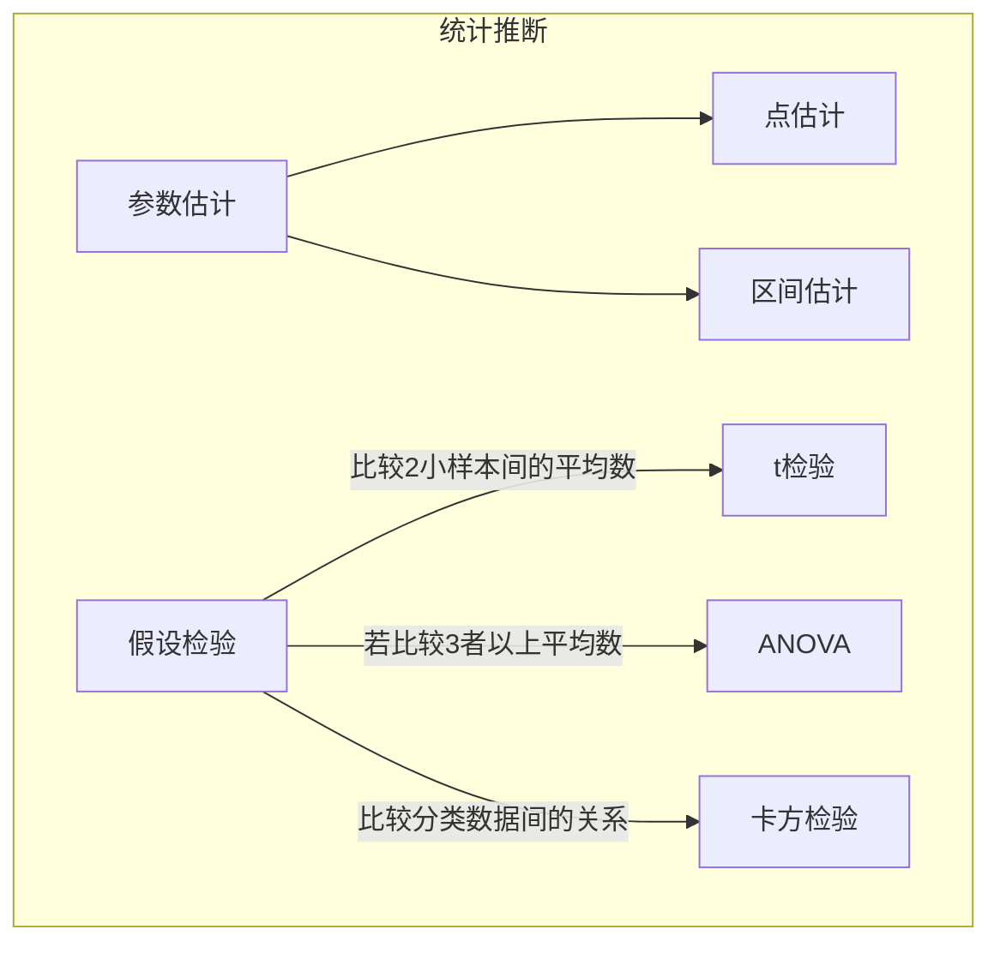
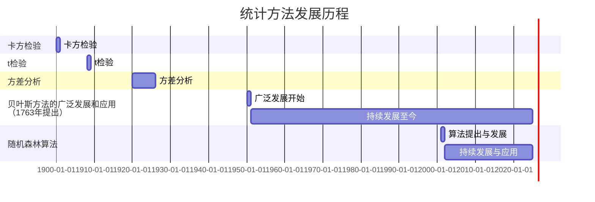

```mermaid
graph TD;
subgraph 分布类型
0[Binomial Distribution]-->|事件的结果>2|00[多项分布]

0-->|当n趋近无穷,p较小|1[Possion分布]

2[Normal Distribution];

2-->21[but i don't how]
2-->22[中心极限定理]
end

click 0 "https://ysz.asia/2024/03/14/Binomial%20Distribution/"
click 00 "https://ysz.asia/2024/03/14/Binomial%20Distribution/"
click 1 "https://ysz.asia/2024/03/16/Poisson%20Distribution/"
click 2 "https://ysz.asia/2024/03/24/Normal%20Distribution/"
click 22 "https://ysz.asia/2024/03/24/Normal%20Distribution/"

```

```mermaid
graph TD;
subgraph 统计推断
1[参数估计]-->1a[点估计]
1-->1b[区间估计]
2[假设检验]-->|比较2小样本间的平均数|2a[t检验]
2[假设检验]-->|若比较3者以上平均数|2b[ANOVA]
2-->|比较分类数据间的关系|2c[卡方检验]
end
click 1a "https://ysz.asia/2024/10/10/interval%20estimation/"
click 1b "https://ysz.asia/2024/10/10/interval%20estimation/"
click 2 "https://ysz.asia/2024/04/04/hypothesis%20testing/"
click 2a "https://ysz.asia/2024/04/05/t%20testing/"
click 2c "https://ysz.asia/2024/04/06/chi%20square%20test/"
```

```mermaid
gantt
    title 统计方法发展历程
    dateFormat YYYY-MM-DD
    section 卡方检验
    卡方检验: 1900-01-01, 1900-12-31
    section t检验
    t检验: 1908-01-01, 1908-12-31
    section 方差分析
    方差分析: 1920-01-01, 1925-12-31
   
    section 贝叶斯方法的广泛发展和应用<br>（1763年提出）
    广泛发展开始: 1950-01-01, 1950-12-31
    持续发展至今: 1951-01-01, 2024-12-31
    
    section 随机森林算法
    算法提出与发展: 2001-01-01, 2001-12-31
    持续发展与应用: 2002-01-01, 2024-12-31
```

```mermaid
flowchart TB
subgraph 统计学的分析流程实际上应该是
    A[定义研究问题和目标] --> B[选择研究设计]
    B --> C[确定统计方法]
    C --> D[收集数据]
    D --> E[数据分析]
    E --> F[解答研究问题]
    
  
end
```

