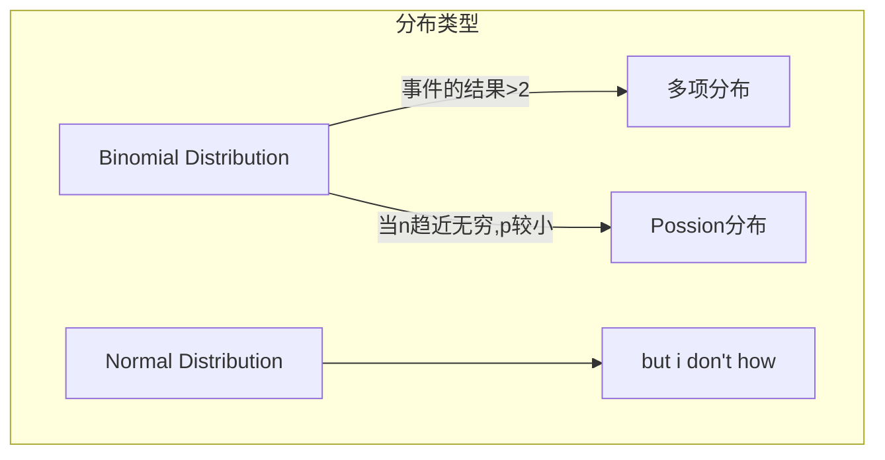
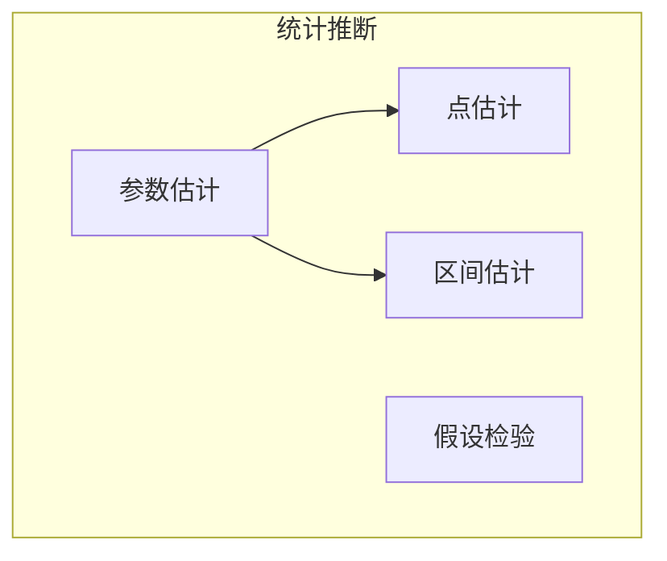

```mermaid
graph TD;
subgraph 分布类型
0[Binomial Distribution]-->|事件的结果>2|00[多项分布]

0-->|当n趋近无穷,p较小|1[Possion分布]

2[Normal Distribution];

2-->21[but i don't how]
end

click 0 "https://ysz.asia/2024/03/14/Binomial%20Distribution/"
click 00 "https://ysz.asia/2024/03/14/Binomial%20Distribution/"
click 1 "https://ysz.asia/2024/03/16/Poisson%20Distribution/"
click 2 "https://ysz.asia/2024/03/24/Normal%20Distribution/"
```

```mermaid
graph TD;
subgraph 统计推断
1[参数估计]-->点估计
1-->区间估计
假设检验
end

```

