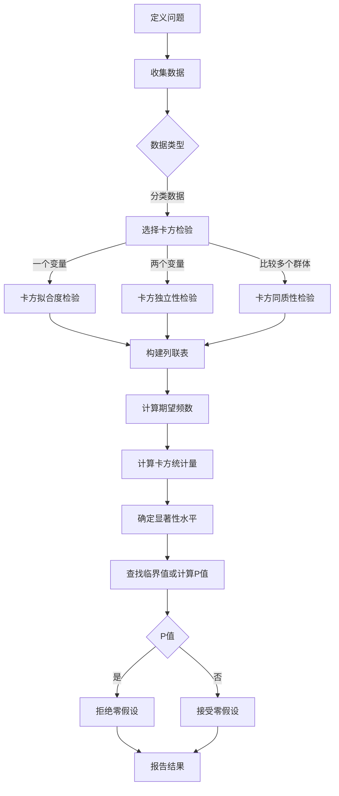
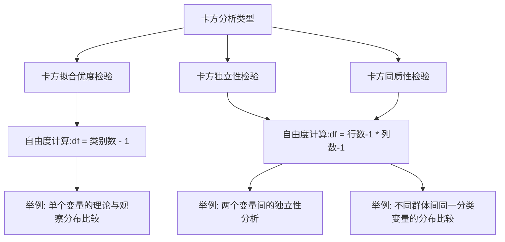

卡方的核心原理：比较观察频数和期望频数

评估观察数据是否与某种理论预期或假设相符合——是一致的。

# 卡方独立性检验（例）

`列联表的本质是两个维度相互作用，而维度里有很多因素，这些因素会相互作用，卡方列联表中：列A代表群体A，列B代表群体B`

## 原始数据A

让我们通过一个简单的例子来理解卡方检验如何用于分析分类数据之间是否存在显著关系。

### 背景
假设一个学校想要研究学生的学习习惯是否与他们的最终考试表现有关。具体来说，学校对学生是否在考前复习（是或否）以及他们的考试成绩（及格或不及格）之间的关系感兴趣。

### 数据收集
我们随机选取了100名学生的数据，收集到以下信息：

- 40名学生在考前复习了，其中35名及格，5名不及格。
- 60名学生在考前没有复习，其中15名及格，45名不及格。

### 目标
使用卡方检验来分析学生是否在考前复习与他们的考试成绩是否及格之间是否存在显著的关系。

### 步骤

1. **建立假设**:
   - 零假设（H0）: 学习习惯和考试成绩之间没有关系。
   - 备择假设（H1）: 学习习惯和考试成绩之间有显著关系。

2. **构造列联表**:

| 学习习惯 | 及格 | 不及格 | 总计 |
| -------- | ---- | ------ | ---- |
| 复习     | 35   | 5      | 40   |
| 不复习   | 15   | 45     | 60   |
| 总计     | 50   | 50     | 100  |

3. **计算期望频数**

`计算chi square的期望频数的核心：将计算期望频数的目标当成一个条件，期望频数是该条件下无限理想的结果`

期望频数的计算公式是：
$E_{ij} = \frac{(行i的总和) \times (列j的总和)}{总样本数}$

以“复习及格”为例，计算为：
$E_{11} = \frac{40 \times 50}{100} = 20$

4. *卡方统计量**。
卡方值的计算公式是：$ \chi^2 = \sum \frac{(O_i - E_i)^2}{E_i} $
其中 $O_i$ 是观察频数，$E_i$ 是期望频数。

对于每一个格子，我们计算观察频数与期望频数之差的平方，然后除以期望频数，最后将所有格子的结果相加。

以“复习及格”和“不复习不及格”为例：

- 对于复习及格：$(35 - 20)^2 / 20 = 11.25$
- 对于复习不及格：$(5 - 20)^2 / 20 = 11.25$
- 对于不复习及格：$(15 - 30)^2 / 30 = 7.5$
- 对于不复习不及格：$(45 - 30)^2 / 30 = 7.5$

卡方值为这些结果的总和：$11.25 + 11.25 + 7.5 + 7.5 = 37.5$

5. **确定显著性水平**（通常为0.05）和**自由度**（在这个例子中为1，因为（行数-1）×（列数-1）=1）。

6. **查找卡方分布表**，确定卡方统计量对应的P值。

   

### 结论
假设计算得到的P值小于0.05，我们将拒绝零假设，得出结论：学生是否在考前复习与他们的考试成绩是否及格之间存在显著的关系。这意味着，学生的学习习惯（至少在这个样本中）似乎影响了他们的考试表现。

这个例子简化了实际操作中的许多步骤，比如计算期望频数和卡方统计量，但它展示了卡方检验评估分类数据之间关系的基本逻辑。

## 原始数据B

要手动计算卡方统计量，并理解其背后的原理，我们将遵循以下步骤，以我们之前提到的电影类型偏好与观众年龄段的例子为基础。

### 步骤 1: 创建列联表

首先，我们已经有了一个3乘3的列联表，显示了不同年龄段的观众对不同电影类型的偏好。这里再重复一遍列联表：

|      | 动作 | 喜剧 | 科幻 | 总计 |
| ---- | ---- | ---- | ---- | ---- |
| 少年 | 30   | 20   | 50   | 100  |
| 成人 | 45   | 55   | 40   | 140  |
| 老年 | 25   | 25   | 35   | 85   |
| 总计 | 100  | 100  | 125  | 325  |

### 步骤 2: 计算期望频数

期望频数是基于边际总和和总样本量。例如，对于动作电影和少年观众的组合，期望频数$ E_{动作,少年} $计算如下：

$ E_{动作,少年} = \frac{(少年总数) \times (动作总数)}{总样本数} = \frac{100 \times 100}{325} $

这一步需要为表中的每一个单元格重复。

### 步骤 3: 计算每个单元格的$ (O_{ij} - E_{ij})^2 / E_{ij} $

一旦我们有了每个单元格的期望频数，我们就可以计算每个单元格的$ (O_{ij} - E_{ij})^2 / E_{ij} $，其中$ O_{ij} $是观察频数，$ E_{ij} $是期望频数。

### 步骤 4: 计算卡方统计量

卡方统计量是所有单元格$ (O_{ij} - E_{ij})^2 / E_{ij} $值的总和。即：

$ \chi^2 = \sum_{所有单元格}\frac{(O_{ij} - E_{ij})^2}{E_{ij}} $

### 步骤 5: 判断显著性

使用计算出的卡方统计量和相应的自由度查找卡方分布表，以确定观察到的统计量是否足够大，从而拒绝零假设（即两变量独立）。

让我们通过计算实际的期望频数开始这个过程。

期望频数如下：

|      | 动作  | 喜剧  | 科幻  |
| ---- | ----- | ----- | ----- |
| 少年 | 30.77 | 30.77 | 38.46 |
| 成人 | 43.08 | 43.08 | 53.85 |
| 老年 | 26.15 | 26.15 | 32.69 |

接下来，我们将使用这些期望频数和原始列联表中的观察频数来计算卡方统计量。

计算出的卡方统计量为14.46。这个统计量表明了观察频数与期望频数之间的偏差程度。接下来，你需要根据自由度（在这个例子中是$ (3-1) \times (3-1) = 4 $）和所选择的显著性水平（通常是0.05），使用卡方分布表或相关软件来确定这个统计量是否足够大，以至于可以拒绝两个变量独立的零假设。

如果卡方统计量大于对应自由度和显著性水平下的临界值，那么我们有足够的证据拒绝零假设，认为电影类型偏好和观众年龄段之间存在统计上的关联。反之，如果卡方统计量小于或等于临界值，我们则没有足够证据拒绝零假设，即我们认为两个变量是独立的。

# 我的疑惑

在以下的例子中，我选择动作和少年作为期望频数，和成人和喜剧作为期望频数，最终对应的结论会是一样的吗？

|      | 动作 | 喜剧 | 科幻 | 总计 |
| ---- | ---- | ---- | ---- | ---- |
| 少年 | 30   | 20   | 50   | 100  |
| 成人 | 45   | 55   | 40   | 140  |
| 老年 | 25   | 25   | 35   | 85   |
| 总计 | 100  | 100  | 125  | 325  |

# 卡方拟合优度检验

### 例子：投掷有偏骰子

假设你有一个六面的有偏骰子，理论上它的每个面朝上的概率不是均等的，而是如下：

| 面   | 理论概率 |
| ---- | -------- |
| 1    | 0.1      |
| 2    | 0.1      |
| 3    | 0.2      |
| 4    | 0.2      |
| 5    | 0.2      |
| 6    | 0.2      |

这意味着，相比于其他面，面1和面2朝上的概率较低。

假设你投掷这个骰子1000次，观察到以下结果：

| 面   | 观察频数 |
| ---- | -------- |
| 1    | 95       |
| 2    | 105      |
| 3    | 200      |
| 4    | 190      |
| 5    | 210      |
| 6    | 200      |

### 步骤1：计算期望频数

期望频数将基于每个面的理论概率计算。例如，面1的期望频数为1000次 * 0.1 = 100次。

### 步骤2：计算卡方统计量

#### 步骤1: 确定期望频数$E_i$

首先，你需要基于理论概率计算每个面的期望频数。总投掷次数是1000次。给定的理论概率如下：

- 面1和面2的理论概率是0.1。
- 面3、面4、面5、和面6的理论概率是0.2。

因此，期望频数计算如下：

- 面1的期望频数 = 1000次 * 0.1 = 100次
- 面2的期望频数 = 1000次 * 0.1 = 100次
- 面3的期望频数 = 1000次 * 0.2 = 200次
- 面4的期望频数 = 1000次 * 0.2 = 200次
- 面5的期望频数 = 1000次 * 0.2 = 200次
- 面6的期望频数 = 1000次 * 0.2 = 200次

#### 步骤2: 计算每个类别的卡方值

接下来，对每个面，使用公式$\frac{(O_i - E_i)^2}{E_i}$计算卡方值，其中$O_i$是观察频数，$E_i$是期望频数。

- 对于面1，$O_i = 95$，$E_i = 100$，卡方值 = $\frac{(95 - 100)^2}{100} = \frac{25}{100} = 0.25$
- 对于面2，$O_i = 105$，$E_i = 100$，卡方值 = $\frac{(105 - 100)^2}{100} = \frac{25}{100} = 0.25$
- 对于面3，$O_i = 200$，$E_i = 200$，卡方值 = $\frac{(200 - 200)^2}{200} = 0$
- 对于面4，$O_i = 190$，$E_i = 200$，卡方值 = $\frac{(190 - 200)^2}{200} = \frac{100}{200} = 0.5$
- 对于面5，$O_i = 210$，$E_i = 200$，卡方值 = $\frac{(210 - 200)^2}{200} = \frac{100}{200} = 0.5$
- 对于面6，$O_i = 200$，$E_i = 200$，卡方值 = $\frac{(200 - 200)^2}{200} = 0$

#### 步骤3: 求和得到总卡方统计量

将所有面的卡方值相加得到总卡方统计量：

总卡方统计量 = 0.25 + 0.25 + 0 + 0.5 + 0.5 + 0 = 1.5

### 步骤4: 使用卡方分布表确定显著性

最后，你需要根据卡方统计量、自由度（在这个例子中为6个面减1，即5）和选择的显著性水平（通常为0.05）来确定是否拒绝零假设。如果卡方统计量超过了对应自由度和显著性水平的临界值，那么我们拒绝零假设，认为观察频数与期望频数有显著差异，即骰子是有偏的。

根据卡方分布表，自由度为5时的临界值通常会查表得知。如果总卡方统计量小于这个临界值，则没有足够证据拒绝零假设，可以认为

`为什么自由度是这样?`

自由度为n−1是因为在计算卡方统计量时，总频数的约束减少了一个参数的自由度。这意味着，在n个类别的情况下，你实际上只能自由地调整*n*−1个类别的期望频数，最后一个类别的期望频数会由前面的*n*−1个类别和总频数的约束自动确定

### 步骤3：比较卡方统计量与临界值

通过卡方分布表和对应的自由度（这里是6-1=5）找到临界值，判断统计量是否显著。

这个例子比公平骰子的更复杂，因为它涉及到不均等的理论概率。这种分析可以揭示是否有足够的证据表明观察结果与理论预期有显著差异，进而可以推断骰子是否确实有偏。

让我们进行计算。

计算结果显示，每个面的期望频数分别是100（对于面1和面2）和200（对于面3、面4、面5、和面6）。计算得到的卡方统计量为1.5。

### 解读结果

- **期望频数**：根据理论概率，我们期待面1和面2各出现100次，而面3、面4、面5、和面6各出现200次。
- **卡方统计量**：1.5，这个值表示观察频数与期望频数之间的总体差异。

要判断这个卡方统计量是否显著，我们需要查看自由度为5（因为有6个面，自由度为$k-1=6-1=5$）时的卡方分布表。显著性水平通常设定为0.05。如果卡方统计量超过该自由度下的临界值，我们有理由拒绝零假设，认为骰子有偏。

根据卡方分布表，自由度为5时，0.05的显著性水平对应的临界值大约是11.07。因为1.5远小于11.07，我们没有足够的证据拒绝零假设，即没有足够的证据证明骰子是有偏的。换句话说，观察到的频数与有偏骰子的理论概率分布相匹配。

这个例子展示了卡方拟合优度检验可以如何应用于评估具有不同理论概率的分类数据是否符合预期分布。

# 卡方独立性

让我们通过一个具体的例子来解释卡方同质性检验，比如研究三个不同城市的人对三种不同运动（篮球、足球、网球）的偏好是否存在显著差异。

### 假设的数据
我们调查了来自三个城市（城市A、城市B、城市C）的人们对这三种运动的偏好，并记录了每种运动在每个城市的支持者数量。

以下是调查结果的列联表：

| 运动/城市 | 城市A | 城市B | 城市C | 总计 |
| --------- | ----- | ----- | ----- | ---- |
| 篮球      | 100   | 150   | 250   | 500  |
| 足球      | 200   | 100   | 200   | 500  |
| 网球      | 300   | 250   | 50    | 600  |
| 总计      | 600   | 500   | 500   | 1600 |

### 步骤1: 提出假设
- 零假设（$H_0$）：三个城市中对这三种运动的偏好分布相同。
- 备择假设（$H_1$）：至少有一个城市中对这三种运动的偏好分布与其他城市不同。

### 步骤2: 计算期望频数
期望频数根据边际总和和整体样本量计算。例如，对于城市A中喜欢篮球的期望频数：
$ E_{篮球,城市A} = \frac{(总计\,篮球) \times (总计\,城市A)}{总样本数} = \frac{500 \times 600}{1600} = 187.5 $

按此方法计算表中每个单元格的期望频数。

### 步骤3: 计算卡方统计量
接着，使用观察频数和期望频数计算卡方统计量。公式为 $\chi^2 = \sum\frac{(O_i - E_i)^2}{E_i}$。

### 步骤4: 确定自由度和临界值
自由度为 $(行数-1) \times (列数-1) = (3-1) \times (3-1) = 4$。然后，根据自由度和预先设定的显著性水平查表得到临界值。

### 步骤5: 做出决策
比较计算出的卡方统计量和临界值，决定是否拒绝零假设。

### 结论
如果卡方统计量大于临界值，我们拒绝零假设，认为不同城市中对这三种运动的偏好存在显著差异；如果卡方统计量小于或等于临界值，我们没有足够证据拒绝零假设，认为三个城市中的人对这三种运动的偏好分布相同。

这个例子展示了如何使用卡方同质性检验来分析和比较不同群体在某个分类变量上的分布是否一致。