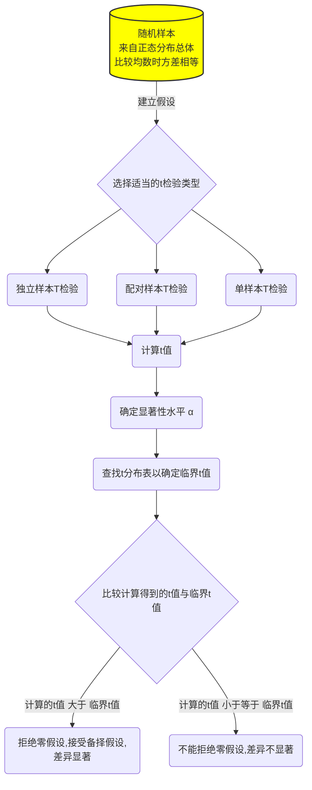
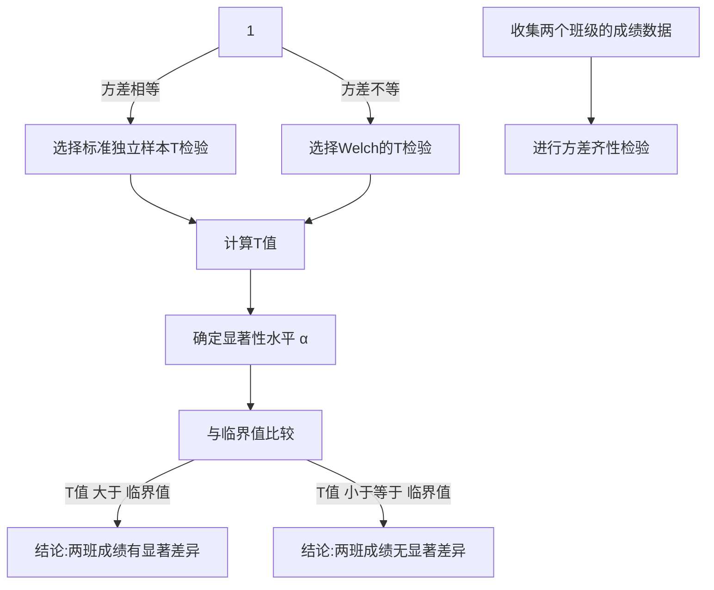

# 使用t检验的一般流程



# 两独立样本t检验




原始数据：

```py
# 将班级A和班级B的成绩罗列出来
classA_scores, classB_scores

Result
(array([78.97371322, 73.89388559, 80.1815083 , 87.18423885, 73.126773  ,
        73.12690434, 87.63370252, 81.13947783, 71.24420491, 79.34048035,
        71.29265846, 71.27416197, 76.93569817, 59.69375804, 61.20065734,
        70.50169977, 66.89735104, 77.51397866, 67.7358074 , 63.70157039,
        86.72519015, 73.1937896 , 75.54022564, 63.60201451, 70.6449382 ,
        75.88738072, 65.79205138, 78.00558415, 70.19489048, 72.66645   ]),
 array([71.98293388, 96.52278185, 77.86502775, 67.42289071, 86.22544912,
        65.7915635 , 80.08863595, 58.40329876, 64.71813951, 79.96861236,
        85.3846658 , 79.71368281, 76.84351718, 74.98896304, 63.2147801 ,
        70.80155792, 73.39361229, 88.57122226, 81.4361829 , 60.36959845,
        81.24083969, 74.1491772 , 71.23078   , 84.11676289, 88.30999522]))
```

进行Levene’s 方差齐性检验

根据我们的示例计算：

A：班级A的平均成绩为83.5分。

B：班级B的平均成绩为86.4分。

C：班级A的平均绝对偏差为4.9分。

D：班级B的平均绝对偏差为4.0分。


1. **计算学生成绩的平均值** 
2. **计算每个学生成绩与平均值的绝对差异**
3. **求这些绝对差异的平均值**
 

E：所有数据的总体平均绝对偏差为4.45分。

F：Levene统计量\(W\)的计算结果为0.403。


Levene统计量\(W\)表示的是在我们的示例数据中，两个班级成绩的方差齐性的检验统计量。计算出的\(W\)值用来与F分布的临界值进行比较，以决定是否拒绝方差齐性的零假设。在实际应用中，我们通常还需要查找或通过统计软件获取相应的p值，以确定这个统计量在给定显著性水平下的显著性。


