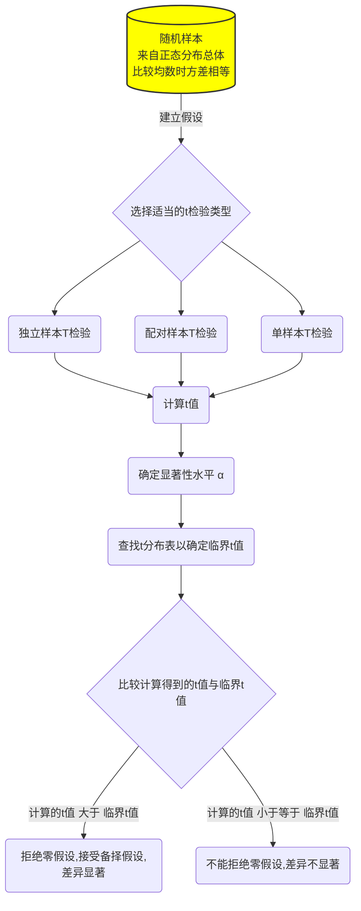
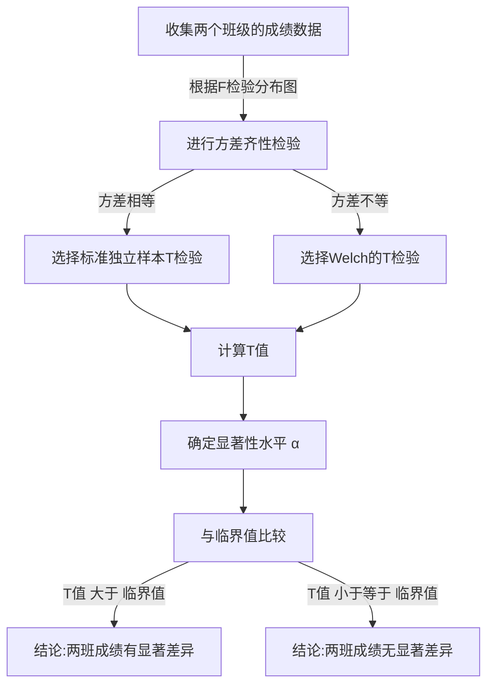
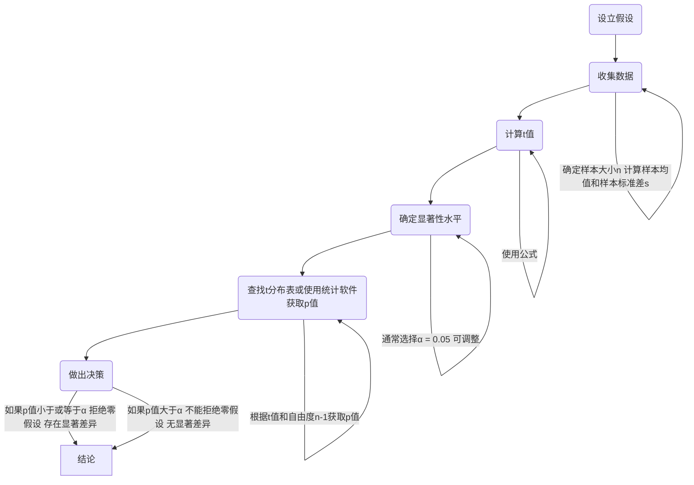
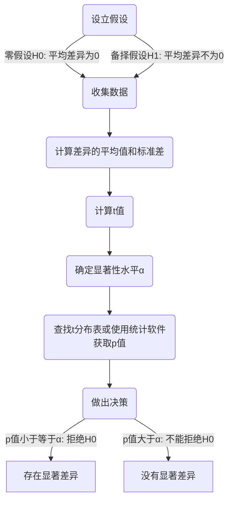

# 使用t检验的一般流程



# 两独立样本t检验




## 原始数据

以下是我的原始数据

```py
# 将班级A和班级B的成绩罗列出来
classA_scores, classB_scores

Result
(array([78.97371322, 73.89388559, 80.1815083 , 87.18423885, 73.126773  ,
        73.12690434, 87.63370252, 81.13947783, 71.24420491, 79.34048035,
        71.29265846, 71.27416197, 76.93569817, 59.69375804, 61.20065734,
        70.50169977, 66.89735104, 77.51397866, 67.7358074 , 63.70157039,
        86.72519015, 73.1937896 , 75.54022564, 63.60201451, 70.6449382 ,
        75.88738072, 65.79205138, 78.00558415, 70.19489048, 72.66645   ]),
 array([71.98293388, 96.52278185, 77.86502775, 67.42289071, 86.22544912,
        65.7915635 , 80.08863595, 58.40329876, 64.71813951, 79.96861236,
        85.3846658 , 79.71368281, 76.84351718, 74.98896304, 63.2147801 ,
        70.80155792, 73.39361229, 88.57122226, 81.4361829 , 60.36959845,
        81.24083969, 74.1491772 , 71.23078222, 84.11676289, 88.30999522]))
```

## 进行Levene’s 方差齐性检验



F检验和Levene检验都是用于统计分析中的方法，它们有不同的应用场景和假设条件。主要区别在于它们对数据的敏感度不同，特别是在处理不满足正态分布假设或方差齐性（homoscedasticity）的数据时。

### F检验

- **用途**：F检验通常用于比较两组数据的方差，以检验它们是否具有相同的方差，即方差齐性。它是许多参数统计测试，如ANOVA（方差分析）的前提条件。
- **假设条件**：F检验对数据的正态分布假设非常敏感。当数据明显偏离正态分布时，F检验的结果可能不可靠。此外，F检验在样本大小不等时可能也不稳健。

### Levene检验

- **用途**：Levene检验是用于检验两个或多个样本的方差是否相等的统计方法。它不仅用于方差分析的前提检验，也适用于其他需要方差齐性假设的统计方法。
- **假设条件**：相比F检验，Levene检验对数据的正态分布假设不那么敏感。它通过对每个样本的每个观测值与其组内平均值（或中位数/均值）的差的绝对值进行分析，来评估方差的一致性。这种方法使得Levene检验在处理非正态分布数据或具有异常值的数据时更为稳健。

### 为什么选择Levene检验而不是F检验？

1. **数据分布的灵活性**：由于Levene检验对数据的正态性假设要求不严格，因此在处理实际数据（尤其是那些可能偏离正态分布的数据）时更加灵活和可靠。
2. **异常值的影响**：Levene检验通过分析观测值与组内平均值（或中位数）的差的绝对值，减少了异常值对检验结果的影响。
3. **应用范围广泛**：Levene检验可以用于两个或多个样本的方差齐性检验，使其在不同的统计分析场景中都能适用。

总之，选择Levene检验还是F检验，主要取决于你的数据特性和分析需求。在实际应用中，如果数据可能违反正态性假设或包含异常值，Levene检验通常是更稳健的选择。

 

### W的计算

根据我们的示例计算：

A：班级A的平均成绩为83.5分。

B：班级B的平均成绩为86.4分。

C：班级A的平均绝对偏差为4.9分。

D：班级B的平均绝对偏差为4.0分。


1. **计算学生成绩的平均值** 
2. **计算每个学生成绩与平均值的绝对差异**
3. **求这些绝对差异的平均值**
 

E：所有数据的总体平均绝对偏差为4.45分。

F：Levene统计量$W$的计算结果为0.403。



  Levene统计量$W$的计算基于方差分析（ANOVA）原理，具体公式为：

$$
W = \frac{(N - k) \sum_{i=1}^{k} n_i (Z_i - Z)^2}{(k - 1) \sum_{i=1}^{k} \sum_{j=1}^{n_i} (|x_{ij} - \bar{x}_i| - Z_i)^2}
$$

其中：

对于两个班级（班级A和班级B）的数学考试成绩进行Levene的方差齐性检验，具体的字母与数字的对应关系如下：

- $N$：总的观测值数量，即两个班级学生总数。班级A有10名学生，班级B也有10名学生，所以$N = 10 + 10 = 20$。
- $k$：组的数量，在这个例子中有两个班级，所以$k=2$。
- $n_i$：第$i$个组中的观测值数量。对于班级A，$n_A = 10$；对于班级B，$n_B = 10$。
- $Z_i$：第$i$个组的绝对偏差均值。在之前的计算中，我们发现班级A的平均绝对偏差$Z_A = 4.9$，班级B的平均绝对偏差$Z_B = 4.0$。
- $Z$：所有观测值绝对偏差的全体均值，即合并班级A和班级B所有绝对偏差后的平均值，计算得$Z = 4.45$。
- $|x_{ij} - \bar{x}_i|$：第$i$个组中第$j$个观测值相对于其组平均值的绝对偏差。对于班级A和班级B的每个学生，我们分别计算了他们的成绩与各自班级平均成绩的绝对差值。

利用上述信息，我们能够计算Levene统计量$W$。在这个例子中，我们已经通过一系列步骤计算出了$W$的值为0.403。这个值表明了我们如何利用给定的数据和Levene检验公式来评估两个班级成绩方差的齐性。在实际操作中，我们会进一步利用这个$W$值来确定其对应的p值，从而做出是否拒绝方差齐性零假设的决策。

 


Levene统计量$W$表示的是在我们的示例数据中，两个班级成绩的方差齐性的检验统计量。计算出的$W$值用来与F分布的临界值进行比较，以决定是否拒绝方差齐性的零假设。在实际应用中，我们通常还需要查找或通过统计软件获取相应的p值，以确定这个统计量在给定显著性水平下的显著性。

### 各种F分布图


根据参数为（自由度、分母)的F图像，得出p值

0假设通常是两条统计量相等，若p值较小那么是一个小概率事件，即拒绝0假设，得出两统计量不相等

~~*本文篇幅有限，仅仅探究方差相等（即方差齐性的情况）*算了…..我还是写完它吧~~

## 选择标准独立样本T检验并计算t值（假设方差相等）


标准的独立样本T检验使用池化方差（$s_p^2$）来估计标准误差，适用于当我们假设两个样本的方差相等时。其计算步骤如下：


1. ### **计算池化方差**:

$$
 s_p^2 = \frac{(n_1 - 1)s_1^2 + (n_2 - 1)s_2^2}{n_1 + n_2 - 2} 
$$


   其中，$n_1$和$n_2$是两个样本的大小，$s_1^2$和$s_2^2$是两个样本的方差。


2. ### **计算标准误差**（SE）:

$$
  SE = \sqrt{s_p^2\left(\frac{1}{n_1} + \frac{1}{n_2}\right)}
$$


3. ### **计算T值**:

$$
  T = \frac{\bar{x}_1 - \bar{x}_2}{SE}
$$

  其中，$\bar{x}_1$和$\bar{x}_2$是两个样本的平均值。

4. ### 自由度的计算

   $$
   df =  (n_1 + n_2 - 2)。
   $$

   

## 选择Welch’sT检验并计算t值（不假设方差相等）


Welch的T检验是一种更通用的方法，它不要求两个样本的方差相等，因此适用于更广泛的情形。其计算步骤如下：


1. ### **直接计算每个样本的标准误差**:

$$
  SE_1 = \frac{s_1^2}{n_1}, \quad SE_2 = \frac{s_2^2}{n_2} 
$$


2. ### **计算两个样本标准误差的和的平方根**（总标准误差，SE）:

$$
  SE = \sqrt{SE_1 + SE_2} 
$$


3. ### **计算T值**:

$$
  T = \frac{\bar{x}_1 - \bar{x}_2}{SE} 
$$


4. ### **自由度的计算**


对于Welch的T检验，自由度（df）的计算比标准T检验复杂，使用以下公式：

$$
df = \frac{(SE_1 + SE_2)^2}{\frac{SE_1^2}{n_1 - 1} + \frac{SE_2^2}{n_2 - 1}}
$$

---

## 总结与实操


\- **标准T检验**假设两个独立样本具有相同的方差，并使用池化方差来计算标准误差和T值。

\- **Welch T检验**不要求两个样本的方差相等，直接计算每个样本的标准误差来估计总标准误差，并据此计算T值，通常给出一个更保守的自由度估计。

在我们的例子中，使用班级A和班级B的数学成绩进行计算：

### 标准的独立样本T检验（假设方差相等）

- **T值**：-1.141
- **$p$值**：0.269
- **自由度（df）**：18

### Welch的T检验（不假设方差相等）

- **T值**：-1.141
- **$p$值**：0.269
- **自由度（df）**：约17.52

### 解释

在这个例子中，不论是使用标准的独立样本T检验还是Welch的T检验，我们都得到了相似的T值和$p$值，表明在显著性水平0.05下，我们没有足够的证据拒绝零假设，即两个班级的数学成绩没有显著差异。这种情况下，班级A和班级B的成绩可以认为在统计学上是相等的。

自由度的差异主要源于两种方法对样本方差不同假设的处理方式。Welch的T检验因为不假设方差齐性，所以通常会有一个略微不同的、更保守的自由度估计。

这个例子展示了如何根据样本方差是否相等，选择合适的独立样本T检验方法，并进行计算。在实际研究中，选择哪种方法取决于样本方差的性质以及研究者的偏好。

# 单样本资料的t检验



## 原始数据

**背景**: 假设你是一名心理学研究者，想要研究大学生的睡眠质量。根据国家健康机构的数据，成年人的平均睡眠时间应为7小时（即总体平均μ=7小时）。你想要测试的假设是，受试的大学生平均睡眠时间是否与这个标准有显著差异。

## 单样本t检验的步骤

1. ### 收集数据:

   你对30名大学生进行了调查，记录他们的平均睡眠时间。假设得到的样本平均睡眠时间$\bar x$=6.5小时，样本标准差$s$=1.2小时。

2. ### 建立假设:

   - **零假设**($H_0$)：样本均值等于总体均值。在我们的例子中，零假设是大学生的平均睡眠时间为7小时。
   - **备择假设**($H_1$)：样本均值不等于总体均值。即大学生的平均睡眠时间不是7小时。

3. ### 收集数据并计算统计量:

   - 在我们的例子中，你调查了30名大学生，发现样本平均睡眠时间$\bar{x}$为6.5小时，样本标准差$s$为1.2小时。

4. ### 计算t值:

   $$
   t = \frac{\bar{x} - \mu}{s / \sqrt{n}}
   $$

5. ### 观察t分布并判断假设结果

   - 使用计算出的t值，我们查找t分布表，以确定与我们的t值对应的p值。p值是在零假设为真的条件下，观察到的结果（或更极端的结果）发生的概率。
   - 在我们的例子中，p值为0.011，这意味着如果大学生的真实平均睡眠时间确实为7小时，那么我们观察到平均睡眠时间为6.5小时（或更极端）的概率仅为1.1%。

6. ### 解释结果

- **p值的解释**: p值用于决定是否拒绝零假设。如果p值小于我们事先设定的显著性水平（通常是0.05），我们就有足够的证据拒绝零假设。
- **在我们的例子中**，因为p值（0.011）小于0.05，我们拒绝零假设，得出结论：有统计学上的显著证据表明大学生的平均睡眠时间不是7小时。

# 配对样本t检验



使用一个更具体的例子来深入理解配对设计资料的t检验：

### 背景

一名营养学研究员想要评估一种新的营养计划对体重管理的效果。为此，她选择了10名志愿者，这些志愿者都希望通过饮食改善来减轻体重。

### 研究设计

- **前测**: 实施新的营养计划之前，研究员记录了每位志愿者的体重（单位：千克）。
- **干预**: 这些志愿者遵循为期一个月的新营养计划。
- **后测**: 计划结束后，再次记录每位志愿者的体重。

### 数据收集

假设我们得到以下体重变化数据（单位：千克），显示了每位志愿者在营养计划前后的体重差异（减少的体重表示为正值）：

| 志愿者 | 前测体重 | 后测体重 | 体重差异(前测 - 后测) |
| ------ | -------- | -------- | --------------------- |
| 1      | 85       | 82       | 3                     |
| 2      | 78       | 75       | 3                     |
| 3      | 92       | 88       | 4                     |
| 4      | 76       | 74       | 2                     |
| 5      | 80       | 77       | 3                     |
| 6      | 88       | 84       | 4                     |
| 7      | 95       | 90       | 5                     |
| 8      | 102      | 97       | 5                     |
| 9      | 77       | 75       | 2                     |
| 10     | 83       | 80       | 3                     |

### 假设设立

- **零假设（$H_0$）**: 营养计划对体重没有影响，即体重差异的平均值等于0。
- **备择假设（$H_1$）**: 营养计划对体重有影响，即体重差异的平均值不等于0。

### 计算

首先，我们计算体重差异的平均值($\bar{d}$)和标准差($s_d$)。然后，使用配对设计资料的t检验公式计算t值，确定显著性：

$ t = \frac{\bar{d}}{s_d / \sqrt{n}} $

其中$n$是志愿者的数量。

### 结论

基于计算结果，如果得到的p值小于0.05，我们将拒绝零假设，这意味着有足够的证据表明营养计划有效地促进了体重减轻。

现在，让我们计算体重差异的平均值、标准差，以及t检验的结果，来确定这个营养计划是否显著影响体重减轻。

在这个例子中，体重差异的平均值($\bar{d}$)为3.4千克，标准差($s_d$)为1.075千克。使用配对设计资料的t检验公式，我们得到的t值为10.002。对应的p值为约0.00000357。

### 结论

因为p值远小于0.05，我们拒绝零假设。这意味着有充分的统计学证据表明这种营养计划显著降低了参与者的体重。这个具体例子展示了配对设计资料的t检验如何用于分析同一组受试者在接受特定干预前后的变化，以及如何通过计算得出科学有效的结论。
