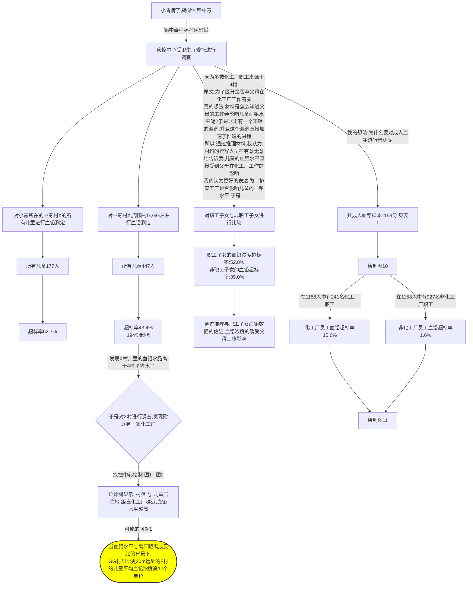
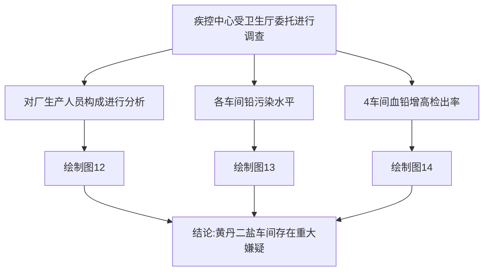

# PBL-第二次第三次作业

### 情景再现

#### 第二幕主要流程

#### 第三幕主要内容

### 绘制的统计图表

#### 表1-村别血铅浓度统计

| 村别     | 人数     | <400μg/L人数 | <400μg/L比例(%) | ≥400μg/L人数 | ≥400μg/L比例(%) | 平均浓度(μg/L) | 最高值(μg/L) |
| -------- | -------- | ------------ | --------------- | ------------ | --------------- | -------------- | ------------ |
| 冯瓦     | 13       | 11           | 84.6            | 2            | 15.4            | 187.0          | 548.0        |
| 高庄     | 207      | 200          | 96.6            | 7            | 3.4             | 110.3          | 579.0        |
| 龚湖     | 3        | 3            | 100             | 0            | 0               | 46.7           | 60.0         |
| 新立     | 607      | 574          | 94.6            | 33           | 5.4             | 128.7          | 622.0        |
| 不详     | 328      | 219          | 97.3            | 9            | 2.7             | 96.4           | 889.0        |
| **总计** | **1158** | **1007**     | **86.9**        | **51**       | **4.4**         | **133.1**      | **622.0**    |

- **整体血铅水平**：总共1158人中，有51人血铅浓度超过400μg/L，占总人数的4.4%。
- **村别超标情况**：
  - 冯瓦村：超标率为15.4%，平均浓度为187.0μg/L。
  - 高庄村：超标率为3.4%，平均浓度为110.3μg/L。
  - 龚湖村：没有超标情况，平均浓度为46.7μg/L。
  - 新立村：超标率为5.4%，平均浓度为128.7μg/L。
  - 不详村：超标率为2.7%，平均浓度为96.4μg/L。
- **最高值观察**：最高血铅值在不详村，达到889.0μg/L，而最低最高值出现在龚湖村，为60.0μg/L。
- **血铅浓度分布**：龚湖村血铅浓度控制得最好，平均浓度和最高值均最低。

#### 图 10 1158份成人血清浓度检测结果-村别统计

发现：经标化处理后发现，F村平均水品较高（平均水平远超其他3村）

#### 图 11 1158人中职工与非职工的血铅超标占比

---

#### 图12-工厂人员构成比

这是一所私人企业，有员工256人，

​	其中1线工人189人，

​	技术人员30人，

​	后勤及管理人员37人

#### 图13-各车间铅污染水平

*注:铅尘国家标准PC-TWA:0.05mg/m

| 车间         | TWA(mg/m3) | 超标倍数 |
| ------------ | ---------- | -------- |
| 黄丹二盐车间 | 0.698      | 13.0     |
| 片状车间     | 0.300      | 5.0      |
| 粉状车间     | 0.188      | 2.8      |
| 液体车间     | 0.008      | -        |

#### 图14-4车间血铅增高检出率

| 车 间        | 总人数 | 血铅增高人数 | 检出率(%) |
| ------------ | ------ | ------------ | --------- |
| 片状车间     | 51     | 16           | 31.4      |
| 粉状车间     | 66     | 15           | 22.7      |
| 黄丹二盐车间 | 45     | 22           | 48.9      |
| 液体车间     | 27     | 3            | 11.1      |
| 技术人员     | 30     | 3            | 10.0      |
| 合计         | 219    | 59           | 26.9      |

结论：所有统计数据指向黄丹二盐车间存在重大嫌疑

### 第二幕的有效信息

#### 统计描述

1. **职工子女与非职工子女血铅浓度比较**：
   - 职工子女血铅平均浓度超标率为52.8%，表明超过一半的职工子女血铅浓度超过了正常范围。
   - 非职工子女血铅平均浓度超标率为39.0%，表明虽然比例较职工子女低，但也有相当一部分非职工子女血铅浓度超标。
2. **成人血铅浓度统计**：
   - 总共检测成人血铅样品1158份，平均浓度为133.1μg/L。
   - 其中51份超出正常值的上限，超标率为4.4%。

#### 统计分析

1. **血铅浓度与居住距化工厂的距离的关系**：
   - 在927名非厂职工中，血铅浓度随着离厂居住距离的增加而下降，这可能表明化工厂的环境对周围居民的血铅浓度有显著影响。

2. **化工厂职工与非职工血铅浓度对比**：
   - 231名化工厂职工中，有36名的血铅水平超过正常值的上限，超标率为15.6%。
   - 相比之下，非化工厂职工的血铅超标率仅为1.6%，表明化工厂职工血铅超标的风险远高于非化工厂职工。

#### 结论

- **化工厂环境的影响**：数据表明，与硬脂酸盐化工厂工作环境相关的职工及其子女的血铅浓度明显高于非职工及其子女，说明化工厂的环境对人体血铅浓度有显著影响。

- **居住距离的作用**：非化工厂职工血铅浓度随居住距离的增加而降低，进一步证实了化工厂对周围环境的影响范围

---

至此,第二幕结束........

## 第三幕的有效信息

略。。。。

黄丹二盐车间存在重大嫌疑

---

至此,第三幕结束........
